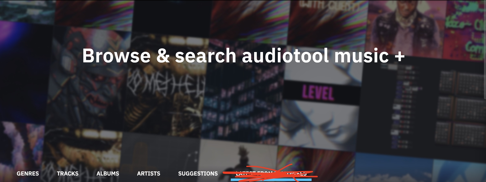
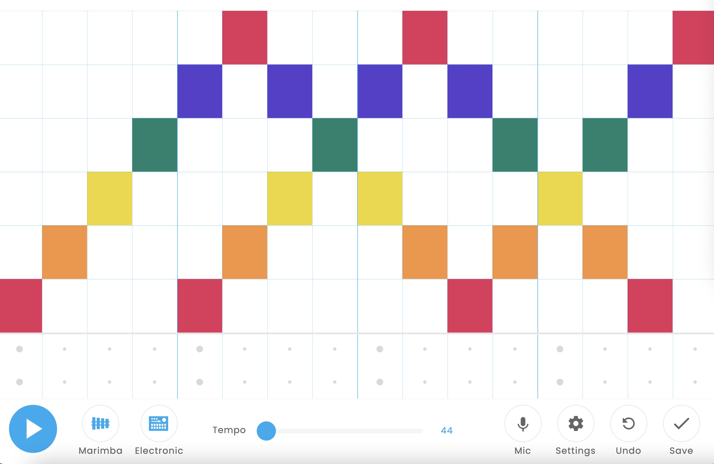
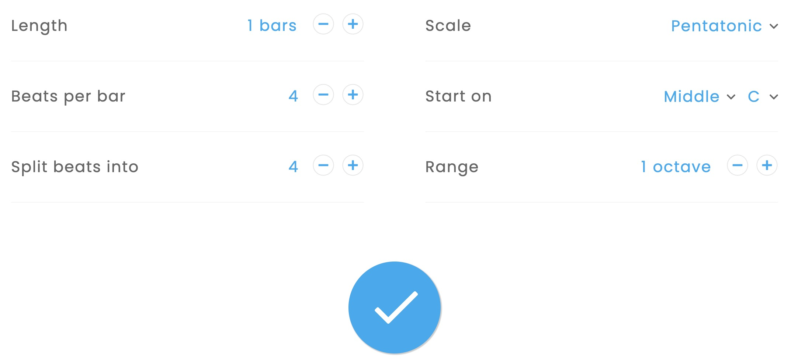
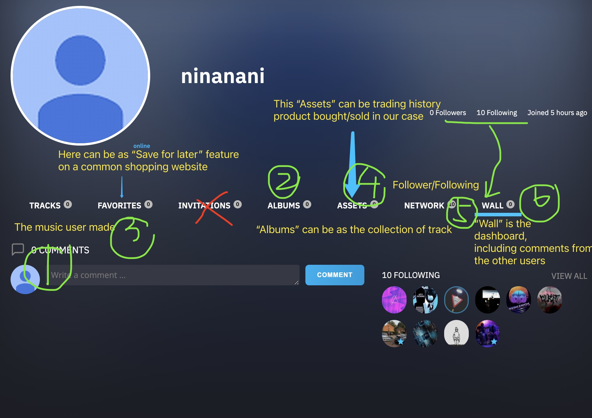

# AudioChef

Huanqing Hu, Wenhao Xue, Junming Liu, Maihan Wen, Queeny Lin

## Cook your music and get NFT

AudioChef is a website provide an easy way for all ages users whom may or may not have music knowledge backgroud to produce their own music and earn by selling their music.
:stuck_out_tongue_closed_eyes:

Pro: have fun to make music, protect creator's copyright & make money :money_mouth_face:

Con: limit embed music sample at the start stage

## WEB UI :heart: :orange_heart: :yellow_heart: :green_heart: :blue_heart: :purple_heart: :brown_heart: :black_heart: :white_heart:

Theme of the whole website, I would like to be dark & cool & electronic :space_invader:

- Homepage: discover & browse music by genres/track/albums/artist/suggestions

  Reference homepage image(at this moment, I haven't decided the navigation bar yet)
  https://www.audiotool.com/browse/genres
  

* Music Kitchen: create your music by clicking the grids

  - Embed Music Samplings:
  - - Instrument: piano , strings, woodwind, synth, marimba, erhu
  - - Percussion(打击乐器)：electronic, blocks, kit, conga, cymbal(钹), tambourine(摇铃)
  - - Mic(麦克风)：for recording people sound
  - - [ ] Keyboard is still planing how to put on the page.
  - - [ ] The design of music making page may need to reorganize.
          Reference page https://musiclab.chromeexperiments.com/Song-Maker/song/6332515798745088
          
          

* User Profile:

  Tracks/Albums/Favorites/Assets/Network/Wallpage

  - Tracks: songs made by user to sell
  - Albums: ablums created by user
  - Favorites: protential songs may buy (save for later)
  - Assets: Songs boughts from other users
  - Networks: flowers/following
  - Wallpage: comments from other users
    
    Or another way to display - Assets: Tracks to sell/Tracks have bought - Networks: flowers/following - Wallpage: comments from other users - [ ] Still planning about the "Assets", and will research other NFT product
    Reference image (random users on audiotool for reference) https://www.audiotool.com/user/bubblicious/tracks

* Product info Page:

  - [ ] Still look for good samples of NFT, and will research other NFT product

* Trading page(subpage of Product page)

  connect wallet

  - [ ] will do research other NFT product

## Framework

(Not that important at this moment)
MERN, blockchain(Ethereum/Algorand/Smart Contract)
